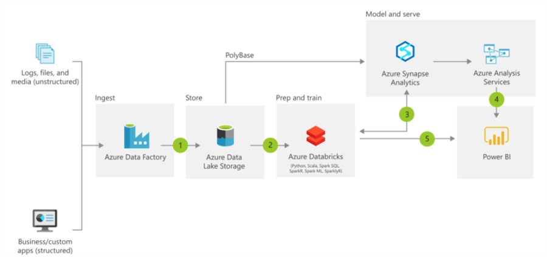
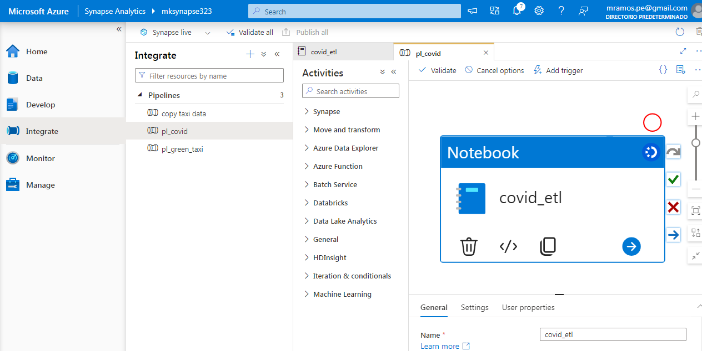
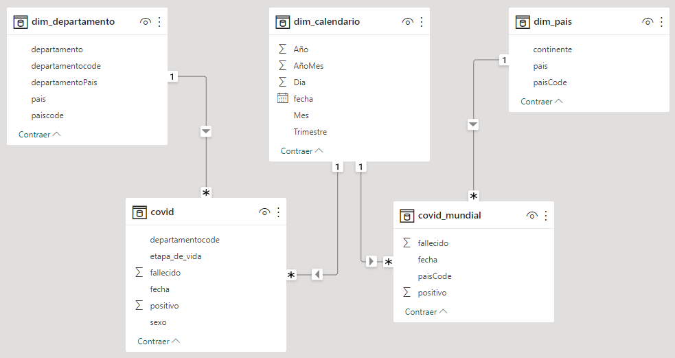

# Proyecto para practicar la integración de Azure Cloud con el proceso ETL. Datafactory + Databricks + Synapse

Proyecto con la infraestructura de nube de Azure, comprobar la canalización de Data Factory para la entrada de datos, usar Azure Databricks para el ETL de datos y asociar Synapse con Power BI. En este caso, utilizamos datos de COVID.

## CONTENIDO - CODIGO FUENTE

- [databrics_covid_etl.ipynb](databrics_covid_etl.ipynb)´: Azure Databricks para el ETL (notebook), luego escribe en las tablas de Azure SQL DB

## DESCRIPCION

Arquitectura del Sistema

Azure Databricks para el ETL (notebook)

Datamart modelo

